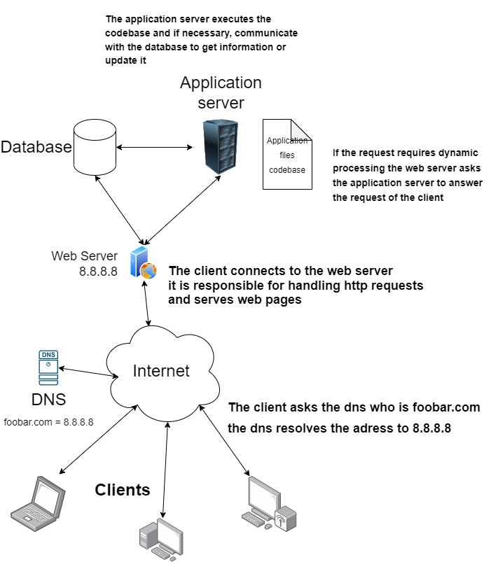

On the simplest exemple for a server, the server is generally located in a data center and can be virtual or physical.
Generally we use the LAMP stack, wich stands for Linux Apache MySQL and PHP.
So the server run a linux operating system on wich we install a web server like apache using (TCP/IP) protocol and run a database with MySql and PHP.
The web server is responsible for handling http requests and serves web pages.
The database's purpose is to store data.
The application server executes the codebase and if necessary, communicate with the database to get information or update it
If the request requires dynamic processing the web server asks the application server to answer the request of the client.
When a client try to connect, he types the domain name on google (for exemple), the dns translate the domain name into an ip adress (8.8.8.8)
Let's say the domain name is foobar.com (it is an Address record because it is resoved as an IP adress)
This server is a Single point of failure because nothing is redundant and so the website would be temporarily down if new code is deployed and the web server would need to be restarted.
This server has a limit to the traffic it could handle and would not scale if the site gain popularity

